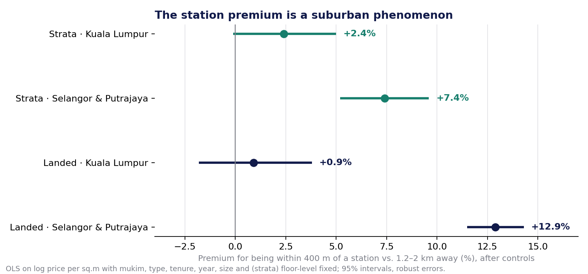
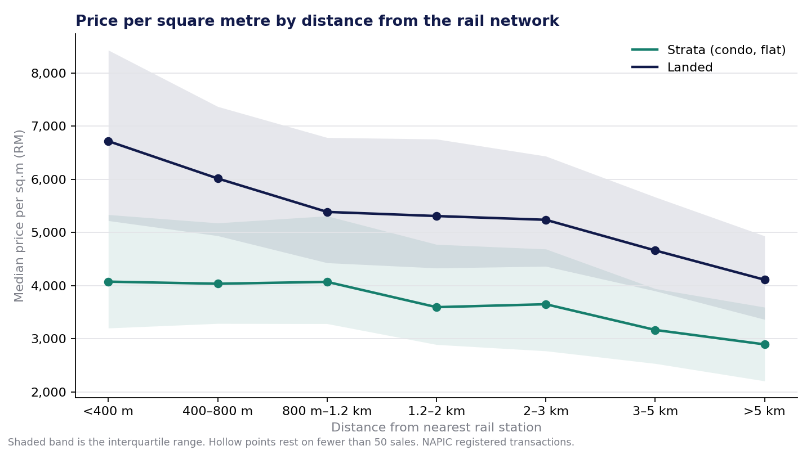

# Trackside

Does a rail station nearby raise property prices in the Klang Valley?

Answered with 120,153 registered property transactions, 215 station coordinates scraped
from Wikipedia, 5,260 schemes geocoded through OpenStreetMap, and a regression that holds
neighbourhood, property type, tenure, year, size and floor level fixed — so the distance
coefficient is not just "central Kuala Lumpur costs more".



---

## Results

**Yes — but almost entirely in the suburbs.** Across the Klang Valley, a home within 400 m
of a rail station sells for more than an equivalent home 1.2–2 km away, and one beyond
5 km sells for less. Inside Kuala Lumpur itself the effect is indistinguishable from zero.

Estimates are the premium on price per square metre, holding neighbourhood (mukim),
property type, tenure, year of sale, unit size and — for strata — floor level fixed, with
robust standard errors. 95% intervals in brackets.

| Within 400 m of a station, vs 1.2–2 km | Kuala Lumpur | Selangor & Putrajaya |
|---|---|---|
| Strata (condo, apartment, flat) | +2.4% [−0.1, +5.0] | **+7.4%** [+5.2, +9.6] |
| Landed | +0.9% [−1.8, +3.8] | **+12.9%** [+11.5, +14.3] |

And the far end: beyond 5 km from any station in Selangor, strata sells for **−5.7%**
[−8.4, −2.9] and landed for **−7.8%** [−8.8, −6.8]. Nearest-to-farthest, that is a 13-point
range for a condominium and a 21-point range for a house.

Pooled across the whole region, the strata gradient is smooth and every band is
significant:

| Distance to nearest station | Strata | n | Landed | n |
|---|---|---|---|---|
| < 400 m | **+3.9%** [+2.3, +5.6] | 2,747 | **+9.4%** [+8.1, +10.8] | 4,391 |
| 400–800 m | +2.5% [+1.1, +4.0] | 4,227 | −0.3% [−1.3, +0.7] | 5,916 |
| 800 m – 1.2 km | +2.3% [+0.9, +3.7] | 3,542 | +2.1% [+1.0, +3.3] | 4,596 |
| 1.2–2 km | reference | 6,225 | reference | 8,827 |
| 2–3 km | +1.5% [+0.1, +2.8] | 3,925 | +2.4% [+1.4, +3.3] | 10,874 |
| 3–5 km | −3.8% [−5.4, −2.2] | 4,487 | +2.1% [+1.1, +3.1] | 11,105 |
| > 5 km | −4.1% [−6.8, −1.2] | 1,606 | **−8.8%** [−9.8, −7.8] | 14,429 |

Landed property behaves differently from strata: a sharp premium at walking distance, a flat
middle, then a drop beyond 5 km — a step rather than a slope. The plausible reading is that
for a house, what matters is whether the station is *walkable*, not how far away it is
otherwise; past a certain distance you drive regardless.



**Scale:** 120,153 residential transactions registered between January 2021 and June 2026
across Kuala Lumpur, Putrajaya and the seven Klang Valley districts of Selangor. 88,469 of
them (74%) were placed on the map through 3,302 geocoded schemes; the rest could not be
located and are excluded rather than imputed. 215 stations. Median distance from a home to
its nearest station is 2.2 km; one in five homes is within 800 m.

## Three things worth explaining

**1. Kuala Lumpur alone gives the opposite answer, and that is the mechanism.**
Run on KL data only, the raw relationship goes the wrong way: strata within 400 m of a
station sold for a median RM 4,585/sqm, those 3–5 km away for RM 7,186. After controls the
premium is roughly zero. The reason is historical. KL's LRT and monorail were threaded through
the older, denser, lower-income corridors — Sentul, Ampang, Cheras, Sri Petaling — while the
expensive low-density districts sit deliberately away from them. In KL, distance from rail is
a marker of exclusivity, and the model cannot separate the two.

In Selangor the lines reach car-dependent townships — Subang Jaya, Kajang, Shah Alam — where
a station is an amenity rather than a marker of which corridor the line was built through.
That is where the premium lives, and running the two territories separately is what makes
that visible. A pooled estimate alone would have averaged a real effect and a null into a
number that describes neither.

**2. The estimate survives the two things most likely to break it.**
Geocoding resolves some schemes only to a road, not a building; dropping those leaves
the strata premium at **+3.6%** within 400 m and **−4.5%** beyond 5 km. 2021 was a pandemic
year with a distorted market; dropping it gives **+3.2%** and **−3.8%**. Same direction,
same size.

**3. This is what the market pays for proximity, not what a station would do to prices.**
Stations were built where people already were, and nearness to one is correlated with
everything else about a location that the mukim fixed effect is too coarse to absorb. The
honest claim is an association: *equivalent homes near stations trade at a premium in the
suburbs and not in the city*. Whether building a station creates that premium is a different
question, answerable only with sales before and after a line opens — the LRT3 Shah Alam line,
opened in June 2026, will make that possible in a few years.


## The question, and why the data source changed

The original plan was rental listings from Mudah.my, the largest Malaysian classifieds site.
Its `robots.txt` permits crawling the listing pages. Its Terms of Use do not:

> "…the User agrees not to reproduce, display or otherwise provide access to the Services
> or Content on another website or server, for example through framing, mirroring, linking,
> spidering, **scraping** or any other technological means… without the prior written
> permission of the Company."

`robots.txt` is a technical courtesy; the terms are the agreement. A scraper that ignores
them is a liability in a public repository, whatever it demonstrates technically. So the
project uses [NAPIC's Open Sales Data](https://napic.jpph.gov.my/en/open-sales-data) instead
— the National Property Information Centre's registry of completed transactions, published
for exactly this kind of use.

That changes the outcome variable from *asking rent* to *registered sale price*. A listing
records what someone hoped to get; NAPIC records what was actually paid. For a question
about what proximity is worth, that is the better number.

## How it's built

Four scripts, each writing what the next one reads.

**1. Stations** — `01_stations.py` scrapes the Wikipedia list of Klang Valley rail stations
(216 rows across KTM, LRT, MRT, monorail, ERL and BRT), then visits each station's article to
read its coordinates from the geo microformat. It identifies itself with a descriptive
User-Agent, waits a second between requests, and caches every page to disk, so a re-run costs
nothing. Articles without a microformat fall through to Wikipedia's coordinates API; the 25
stations with no coordinates anywhere on Wikipedia — mostly the new LRT3 line — are placed
by OpenStreetMap in step 3 and tagged as such.

**2. Transactions** — `02_transactions.py` reads NAPIC's Excel exports. They are
pivot-shaped: a value that repeats the row above is left blank, so six columns need
forward-filling before any row means anything on its own. Prices arrive as
`RM1,600,000.00`. For strata units the parcel area sits in the *land* column and floor
area is empty; for landed property it is the reverse. The loader untangles all of that,
keeps the nine Klang Valley districts, drops rows that cannot support a price-per-area
comparison, and trims the top and bottom half-percent of price per square metre — a
RM 17,000 "sale" is a data-entry artefact, not a market signal.

**3. Geocoding** — `03_geocode.py` places each distinct scheme (a condominium, a housing
estate) through Nominatim, one request per second as their policy requires, with every
result cached. NAPIC abbreviates Malay place words inconsistently — `TMN`, `KG`, `KAW`,
`BDR` — so a normaliser expands them before querying, strips annotations like
`(PKNS HOUSING SCHEME)`, and falls back to the scheme's most common road name when the
scheme itself cannot be found. Every result records which level it resolved at, so the
analysis can check whether road-level placements change the answer.

**4. Analysis** — `04_analyse.py` joins the three, finds each transaction's nearest open
station with a k-d tree, measures the distance by haversine, and bins it. It then fits
log price-per-square-metre on distance band with fixed effects for mukim (the neighbourhood
unit inside a district), property type, tenure, year, floor level and unit size, using
robust standard errors. Strata and landed are modelled separately, and the strata model is
re-run on scheme-level geocodes only and on 2022 onward as robustness checks.

```
pipeline/
  01_stations.py         Wikipedia scrape -> data/stations.csv
  02_transactions.py     NAPIC Excel -> data/transactions.parquet
  03_geocode.py          Nominatim, cached -> data/scheme_coords.csv
  04_analyse.py          join, distance, regression -> outputs/
  data/geocode_cache.json   every lookup ever made, committed so nobody re-runs five hours
  outputs/results.json      every estimate with its interval and n
  outputs/figures/          the three charts
```

## Running it

Install dependencies:

```bash
cd pipeline && pip install -r requirements.txt
```

Stations, about four minutes on first run and instant after:

```bash
cd pipeline && python 01_stations.py
```

Download the NAPIC exports by hand — the portal is a form, not a URL. On the
[Open Sales Data](https://napic.jpph.gov.my/en/open-sales-data) page choose *Residential*,
one state at a time (*WP Kuala Lumpur*, *Selangor*, *WP Putrajaya*), all property types, all
years, and click *Download Excel/CSV*. Save the files into `pipeline/data/raw/napic/`. Then:

```bash
cd pipeline && python 02_transactions.py
```

Geocoding. The cache is committed, so most lookups are already answered; new schemes run at
one per second:

```bash
cd pipeline && python 03_geocode.py --stations --schemes
```

Analysis, under a minute:

```bash
cd pipeline && python 04_analyse.py
```

## Limitations

- **Association, not causation.** Stations were built where people already were, and
  nearness to a station is correlated with everything else about a location. The mukim fixed
  effects absorb the coarse neighbourhood, but not the fine grain. This measures what the
  market pays for proximity, not what a new station would do to prices.
- **Geocoding is imperfect.** Not every scheme resolves; those that do resolve to a point,
  not a footprint, and some resolve at road level rather than building level. The
  scheme-only robustness check exists because of this.
- **Landed property has few far-from-rail sales in KL.** The far bands are thin there; the
  Selangor data is what populates them.
- **NAPIC's export omits some fields** — parcel area is missing for a share of strata sales,
  which are dropped rather than imputed.
- **The window includes a pandemic year.** 2021 transactions happened under moratoria and
  movement restrictions; the 2022-onward robustness check is there for that reason.

## Data and licences

- **Transactions:** National Property Information Centre (NAPIC), Valuation and Property
  Services Department, Ministry of Finance Malaysia — Open Sales Data. Not redistributed
  here; the portal does not state a licence and the download is documented above.
- **Stations:** Wikipedia, *List of rail transit stations in the Klang Valley area* and the
  linked station articles, CC BY-SA 4.0. `data/stations.csv` is derived from it.
- **Geocoding:** © OpenStreetMap contributors, via Nominatim, ODbL. `data/geocode_cache.json`
  and `data/scheme_coords.csv` are derived from it.
